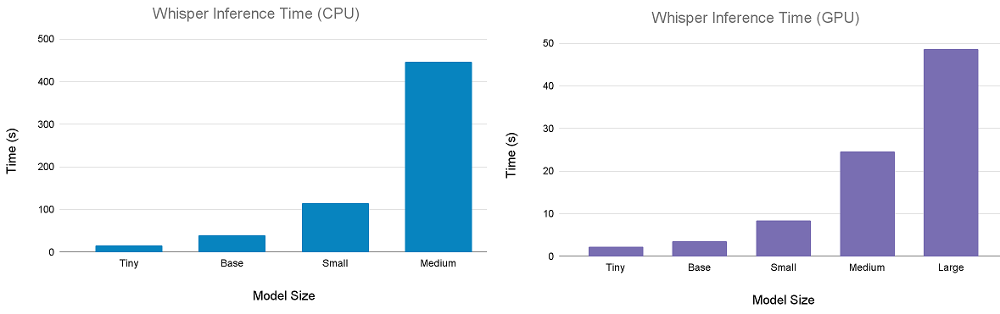

# Usage:

- " "

## Using [Colab](https://research.google.com/colaboratory/faq.html#whats-colaboratory)

- " "
- When using a standard (free) runtime, running both whisper and pyannote/speaker-diarization on long audio files can take hours (see [time and performance](#scrollTo#todo). Once you've selected your options, started your runtime, and uploaded your file, you can close the tab or leave it in the background until it finishes. However, you should take colab's [usage limits](https://research.google.com/colaboratory/faq.html#usage-limits) and [idle timeout rules](https://research.google.com/colaboratory/faq.html#idle-timeouts) into account when deciding how to use the notebooks. If you do experience a runtime interruption, you may need to [reset your runtime](https://research.google.com/colaboratory/faq.html#forced-availability).
- More about colab's [free vs subscription](https://colab.research.google.com/#scrollTo=BJW8Qi-pPpep) runtimes 
- " "

## Time and Performance considerations

 graphs 

   

## Troubleshooting

 short troubleshooting video 

   
## Todo:

  

- [ ] write all the documentation and usage guide
- [ ] add more image resources, add to notebook 
- [ ] write separate notebooks for whispy, diarize, and merge

